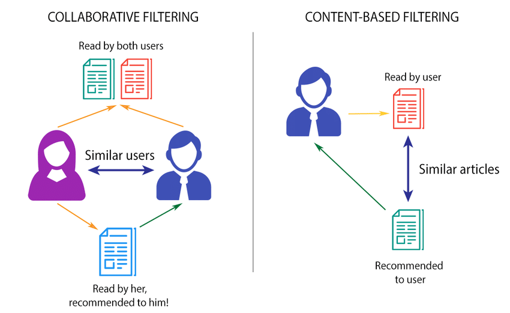

# Movie Recommendation System using Machine Learning

This project implements a content-based movie recommendation system using machine learning techniques. The system suggests movies to users based on similarities between movie attributes.

## Features

- **Content-Based Filtering:** Recommends movies based on similarities in movie attributes such as genre, cast, director, and plot keywords.
- **User Interface:** Provides a user-friendly interface to input preferences and receive personalized movie recommendations.
- **Search Functionality:** Allows users to search for specific movies and view recommendations related to the searched movie.




## Installation

1. Clone the repository:

   ```bash
   git clone https://github.com/mk0380/Movie-Recommendation-System.git
   cd Movie-Recommendation-System

2. Ensure you have Python 3.8 or higher installed.
3. Install the required dependencies:

   ```bash
   pip install -r requirements.txt

4. Run the application:

   ```bash
   streamlit run app.py

## Support
  If you encounter any issues or have any questions, contact the project maintainer at [mayankkr21@iitk.ac.in].

